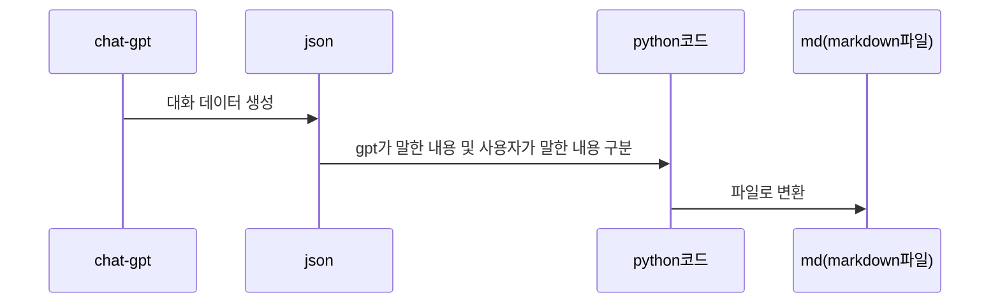

# gpt-json-to-md
## 1. 저장될 위치를 선택
## 2. GPT의 파일로 다운로드를 클릭 후 Json파일을 클릭
## 3. 1번에서 선택한 위치에 md(마크다운 파일)이 생성된 것을 확인

chat-gpt에서 받은 json 파일을 마크다운 파일로 변경하는 코드입니다.

```mermaid
sequenceDiagram
chat-gpt->>json: 대화 데이터 생성
json->>python코드: gpt가 말한 내용 및 사용자가 말한 내용 구분
python코드->>md(markdown파일): 파일로 변환

```