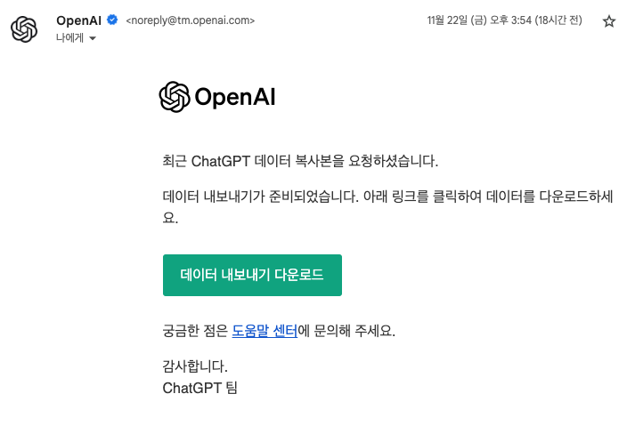
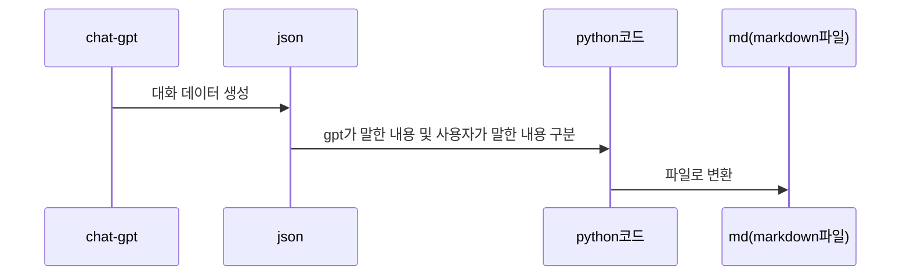

# gpt-json-to-md
> 업데이트 내역  
2024-11-22 : conversation의 내용 중 빈칸만을 출력된 내용(그림은 데이터로 오지 않음)

## Chagpt에서 계정 - 설정 - 데이터 제어 - 데이터 내보내기 클릭  

메일이 오면 다운로드 해줍니다.  



### 추천되는 python 버전
python 3.11, 3.12    

python으로 실행  
```bash
python make_Json_to_md_gpt.py
```

1. output 결과물의 저장 위치를 첫 번째로 선택합니다.
2. 메일에서 받은 파일에서 conversations.json파일을 클릭
3. 1번에서 선택한 위치에 md(마크다운 파일)이 생성된 것을 확인


chat-gpt에서 받은 conversation.json 파일을 마크다운 파일로 변경하는 코드입니다.

